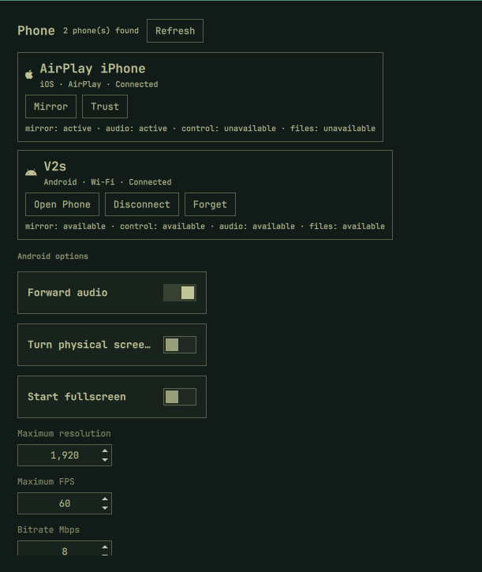
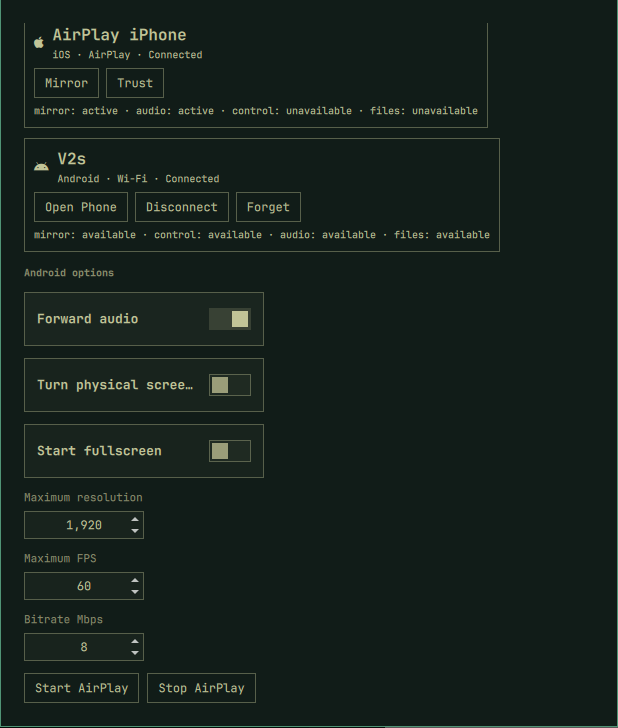
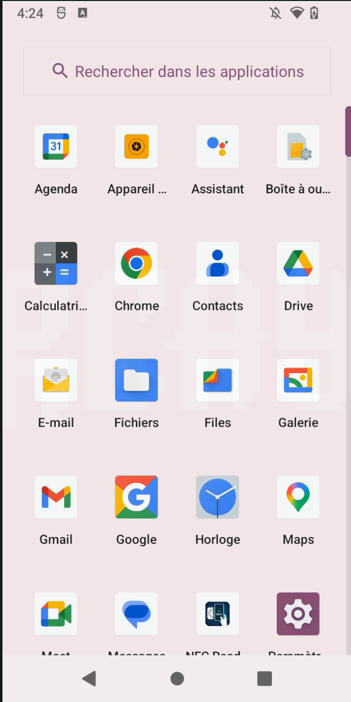
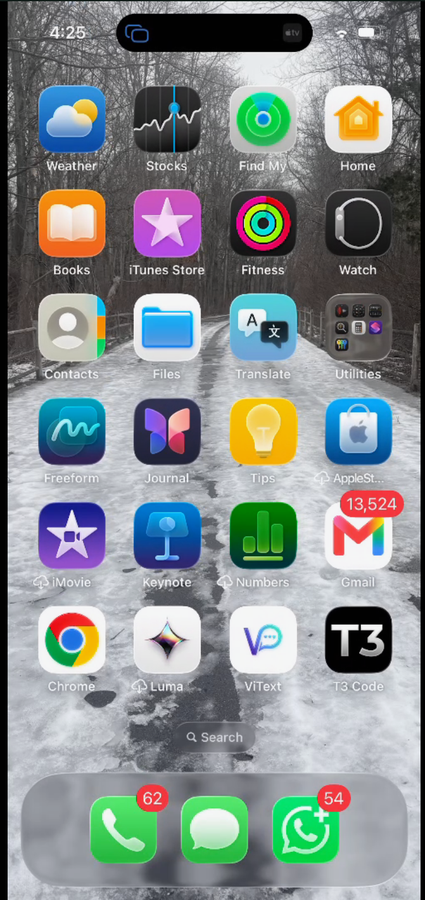

# Omarchy Phone

[](https://github.com/HANCORE-linux/omarchy-plugin-marketplace/issues/1616)
[](LICENSE)

The first application built with [Omarchy UI](https://github.com/AdamMusa/omarchy-ui).
It provides Android discovery, wireless pairing, scrcpy control, iPhone discovery, and AirPlay
mirroring from an Omarchy bar widget and panel.

## App menu

<p align="center">
  
  
</p>

Connected Android and iPhone devices appear automatically in one menu. The available actions and
capabilities are shown per device, including Android control and iPhone AirPlay status.

## Android and iOS previews

<table>
  <tr>
    <th width="50%">Android preview</th>
    <th width="50%">iOS preview</th>
  </tr>
  <tr>
    <td></td>
    <td></td>
  </tr>
</table>

Android sessions support mouse and keyboard control through scrcpy. iPhone sessions mirror video
and audio through AirPlay; Apple does not permit remote touch or keyboard input through AirPlay.

## Features

- Discover Android and iPhone devices automatically.
- Pair Android 11+ devices using Wireless debugging.
- Mirror and control Android through scrcpy, with audio, resolution, FPS, bitrate, fullscreen,
  and physical-screen options.
- Mirror iPhone video and audio through AirPlay with an on-screen PIN.
- Show connection status and device-specific actions in the Omarchy bar and panel.
- Run without Ruby, mruby, or the `omarchy-ui` gem installed on the destination computer.

## Install

Omarchy Phone is [submitted for inclusion in the Omarchy Plugin Marketplace](https://github.com/HANCORE-linux/omarchy-plugin-marketplace/issues/1616).
Until the listing is approved, install directly from its public repository:

```bash
omarchy plugin add https://github.com/AdamMusa/omarchy-phone.git --enable
```

Review third-party plugin code before enabling it. Omarchy plugins run with your user account.

The repository is self-contained: it includes its QML bridge and prebuilt x86-64 mruby runtime.
The current release supports x86-64 Linux systems running Omarchy with the Quickshell plugin host.

## Capabilities and system tools

The plugin itself does not install system packages. Install only the tools needed for the features
you plan to use:

| Capability | Command used | Required tool |
| --- | --- | --- |
| Android discovery, pairing, and Wi-Fi connection | `adb` | Android platform tools |
| Android mirroring and mouse/keyboard control | `scrcpy` | scrcpy |
| Trusted USB iPhone discovery and pairing | `idevice_id`, `ideviceinfo`, `idevicepair` | libimobiledevice |
| iPhone screen and audio mirroring | `uxplay` | UxPlay |
| Wireless Android service discovery | `avahi-browse` | Avahi tools |

Android supports remote control through scrcpy. AirPlay mirrors an iPhone but cannot send touch
or keyboard input back to iOS.

## Android quick start

Android 11 or newer and the Omarchy computer must be on the same Wi-Fi network.

1. On Android, enable **Settings → System → Developer options → Wireless debugging**.
2. Tap **Pair device with pairing code**. Keep this popup open.
3. In Omarchy Phone under **Connect Android**, enter the popup's complete temporary pairing address
   (`IP:port`) and its six-digit code, then click **Pair** before the code expires.
4. The phone remains listed as **Paired** even while Android rotates its connection port.
5. Click **Connect** on the paired phone; Omarchy Phone resolves the current wireless service.
6. When it becomes connected, click **Open Phone** to start scrcpy and control it.

### If the screen mirrors but you cannot control it

Some vendor Android builds refuse the `INJECT_EVENTS` permission that scrcpy's default `sdk`
input mode relies on, and report this in the scrcpy log:

```
[server] ERROR: Injecting input events requires the caller ... to have the INJECT_EVENTS permission.
[server] ERROR: Make sure you have enabled "USB debugging (Security Settings)" and then rebooted your device.
```

The screen mirrors correctly but clicks and keystrokes are ignored. This has been reported on
Xiaomi and POCO (HyperOS and MIUI), Oppo, and some Samsung devices. The suggested
`USB debugging (Security settings)` toggle needs a vendor account and a SIM, and on some ROMs it
is not present at all.

Omarchy Phone therefore starts scrcpy with `--mouse=uhid` alongside `--keyboard=uhid`, which
simulates a physical HID device instead of asking Android to inject events, so control works
without that permission. One side effect worth knowing: in `uhid` mode scrcpy captures the
pointer, so press `LAlt` or `LSuper` to give the mouse back to the computer.

On a device that blocks injection you may still see one `INJECT_EVENTS` line at startup, from
scrcpy's attempt to wake the screen. It is harmless and the session works normally.

Generate a new pairing popup if pairing reports that the code expired. Pairing establishes trust
once. If Android changes its wireless connection port, pair again so the current service can be
discovered and remembered.

## iPhone quick start

For AirPlay mirroring, connect the iPhone and Omarchy computer to the same trusted network:

1. Click **Start AirPlay** in Omarchy Phone.
2. Note the four-digit PIN displayed in the panel and desktop notification.
3. On iPhone, open Control Center, tap **Screen Mirroring**, and select **Omarchy**.
4. Enter the PIN on the iPhone when prompted.
5. Click **Stop AirPlay** when finished.

For USB discovery, connect and unlock the iPhone, accept **Trust This Computer**, and use the
**Trust** action in Omarchy Phone if it appears. iOS permits mirroring but not remote touch or
keyboard control.

## AirPlay and firewall

UxPlay uses TCP and UDP ports `7100-7102`; mDNS discovery uses UDP `5353`. If UFW is enabled,
allow those ports from the local network. Starting AirPlay displays a four-digit PIN in the
panel and desktop notification. Active AirPlay sessions appear automatically in the device list.

## Update or remove

```bash
omarchy plugin update izeesoft.omarchy-phone
omarchy plugin remove izeesoft.omarchy-phone
```

The plugin stores connection metadata and process logs in
`~/.local/state/omarchy-phone-ruby`. Removing the plugin leaves this local state in place so a
future installation can remember paired Android devices. Delete that directory manually if you
also want to forget the saved state.

## Privacy and permissions

Omarchy Phone runs as the current user and starts only the local tools listed above. It communicates
with phones through USB or the local network, does not provide telemetry, and does not send device
information to an external service. Android pairing addresses and runtime logs remain in the local
state directory. The bundled `omarchy-ui-runtime` is an x86-64 executable built from the
[Omarchy UI source](https://github.com/AdamMusa/omarchy-ui). It is byte-for-byte the
[`runtime-v0.1.0` release artifact](https://github.com/AdamMusa/omarchy-ui/releases/tag/runtime-v0.1.0),
whose digest is bound to the reviewed source revision by a
[GitHub artifact attestation](https://github.com/AdamMusa/omarchy-ui/attestations/42660584).
The exact inputs, remote build, independent verification commands, and digest are recorded in
[`RUNTIME_PROVENANCE.md`](RUNTIME_PROVENANCE.md) and
[`omarchy-ui-runtime.sha256`](omarchy-ui-runtime.sha256).

Command output is limited before it reaches application state, discovery results have item and
string ceilings, and runtime protocol messages are size-bounded before QML buffering. External
device text is rendered as plain text. AirPlay shutdown verifies the saved PID, process start time,
process group, and executable identity immediately before signaling; stale, replaced, symlinked,
or non-regular state records are cleared without signaling a process.

## Marketplace submission

- Plugin ID: `izeesoft.omarchy-phone`
- Category: Hardware
- Kinds: service, bar widget, and panel
- License: MIT
- Submission: [HANCORE-linux/omarchy-plugin-marketplace#1616](https://github.com/HANCORE-linux/omarchy-plugin-marketplace/issues/1616)
- Root preview: [`preview.png`](preview.png)

The automated repository, manifest, README, license, and Quattro compatibility checks passed. The
bundled runtime is disclosed for the marketplace's required manual executable review.

## Development

Application behavior lives in `main.rb` and `lib/phone_backend.rb`. QML bridge files and
`omarchy-ui-runtime` are generated distribution artifacts owned by Omarchy UI; do not edit them
inside this project.

Build and validate the complete plugin before publishing:

```bash
sha256sum -c omarchy-ui-runtime.sha256
ruby test/phone_backend_test.rb
omarchy_ui bundle
omarchy plugin validate dist/omarchy-phone-plugin
```

## License

MIT.
